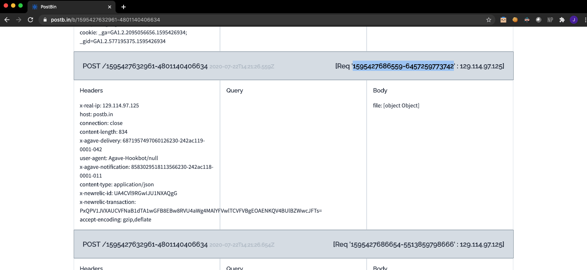

Troubleshooting
=======================

Notifications
------------
If the reactor never executed, you can check the notifications
are working by posting notifications to requestbin using the
``add_notify_requestbin.py`` script in the ``abaco_notifications`` directory:
::
  python add_notify_requestbin.py $AGAVE_SYSTEM_NAME $PATH_TO_DIRECTORY
  assocationIds = 344770698063965720-242ac112-0001-002
  notification id: 8583029518113566230-242ac118-0001-011
  notification url: https://postb.in/b/1595427632961-4801140406634

You can re-upload the file and check the requestbin url to see if it receives the notification:
::
  # tapis files upload agave://urrutia.stampede2.storage/work/05369/urrutia/stampede2/fastqc reads1.fastq.gz
  tapis files upload agave://$SYSTEM/$PATH/ $FILE

You can go to the PostBin URL to see all the requests, and to get more information about
a specific request you can copy/paste the Request ID into a browser in this format:
::
  # https://postb.in/api/bin/1595427632961-4801140406634/req/1595427686559-6457259773742
  https://postb.in/api/bin/$BIN_ID/req/$REQUEST_ID

Added to many notificatons? You can delete them individually with:
::
  tapis notifications delete $NOTIFICATON_ID

Or, if you just want to git rid of all your notifications, you can run:
::
  tapis notifications list -c id  -f value | xargs -n 1 tapis notifications delete

Reactor
---------
If the reactor executed, but did not launch your app, you can check the reactor logs:
::
  tapis actors execs logs $ACTOR_ID $EXECUTION_ID

You can then edit your reactor.py or config.yml as needed, and redeploy the actor.
If you want to redeploy your reactor but don't want to re-create
the notification, you can deploy your reactor to the same actor id with:
::
  # tapis actors deploy -I X4blX3Ez65qQZ
  tapis actors deploy -I $ACTOR_ID

Application
-----------
If the app launched, but you are not getting the output you expect,
you can check the app logs. Run jobs-list to find the relevant job_ID, then you can run:
::
  # tapis jobs outputs download 485458bc-335d-4d05-ae30-70de2583b6d5-007
  tapis jobs show $JOB_ID
  # and check the lastStatusMessage
  tapis jobs outputs download $JOB_ID
  # and check the .err and .our files
